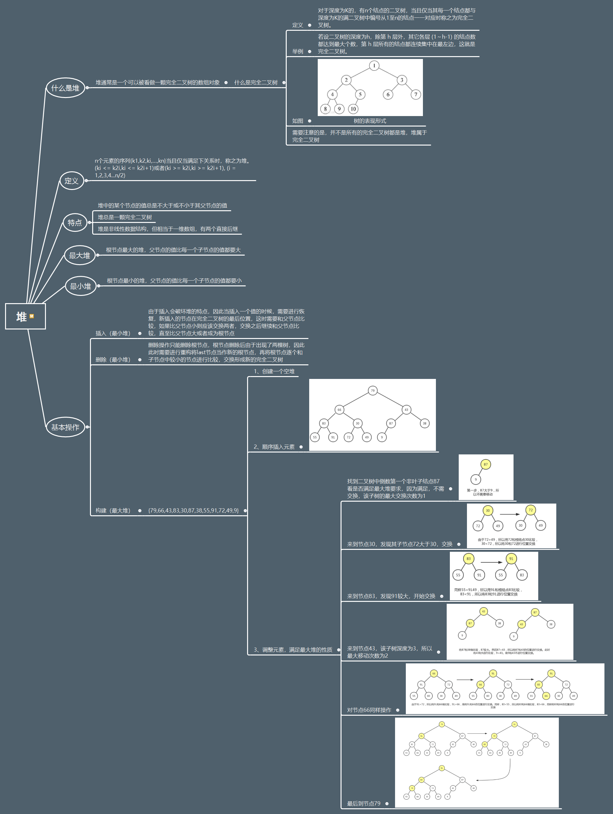
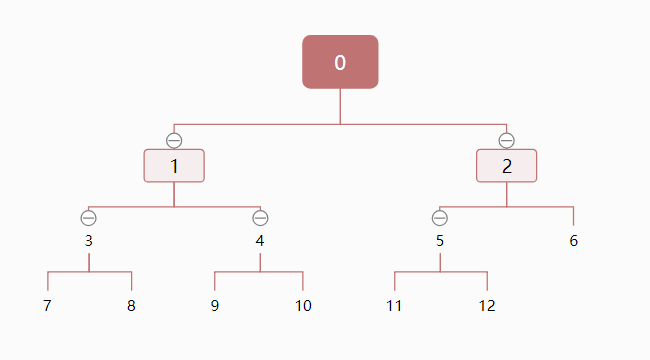

#### 解法三：用堆代替数组

请看如下的思维导图：
**关注公众号回复关键词【堆】查看高清大图**


#### 解题思路
知道了如上定义，我们就可以将容量为K的最大堆存储我们的最小k个数，因此我们仍然可以假设堆，再通过比较替换或不替换堆来最终找到我们的最小的k个数。此解法与解法二类似但由于使用堆时进行查找或更新的时间复杂度降低到了O(logk),那么通过遍历剩余的n-k个数，那么最坏情况下的时间复杂度为O(k + (n-k)logk) = O(nlogk)。这里的O(k)为建堆时的时间复杂度。

因此我们需要建堆，通过以上的分析我们可以用一维数组存储我们的堆,我们先来看一个完全二叉树找一下规律<br />
我们将1，2，3，4，5分别作为下标，在上个图片的思路中，我们可以发现每次我们的遍历刚开始指向的是一个由子节点的父节点，在下图中可知子节点(i)和父节点(l)之间的关系是2 * i + 1 = l，且在同一深度相邻节点相差为1，由上图可知，我们在遍历父节点比较时，依次会经过5，4，3，2，1，0这些下标指向的数值。因此我们可以依次为循环，每次循环的操作都是父节点和子节点进行比较。




#### 代码分析
(1) 循环每一个父节点
(2) 在子节点中找到最大值和父节点比较，若子节点大，则替换
(3) 每次提换后需要记录新的父节点，重新和子节点比较，替换，如下标为2和5的进行替换后，还要保证下标5（原来的下标2）是否满足最大堆性质。因为是同样的操作，因此该过程仍然是一个循环，循环结束的标志是最后一层的叶节点。

#### 完整代码如下
```go
func BuildMaxHeap(data []int) {
	for i := len(data)/2 - 1; i >= 0; i-- {
		adjustDown(data, i)
	}
}
func adjustDown(data []int, i int) {

	for largest := 2*i + 1; largest < len(data); largest = 2*largest + 1 {
		if largest == len(data)-1 {
			if data[largest] > data[i] {
				// fmt.Println(data[largest], "和", data[i], "进行交换")
				data[largest], data[i] = data[i], data[largest]
				i = largest
			} else {
				// fmt.Println(data[largest], "不和", data[i], "进行交换")
			}
		} else {
			if data[largest+1] > data[largest] && data[largest+1] > data[i] {
				// fmt.Println(data[largest+1], "和", data[i], "进行交换")
				data[largest+1], data[i] = data[i], data[largest+1]
				i = largest
			} else if data[largest+1] < data[largest] && data[largest] > data[i] {
				// fmt.Println(data[largest], "和", data[i], "进行交换")
				data[largest], data[i] = data[i], data[largest]
				i = largest
			} else {
				// fmt.Println(data[largest], "或", data[largest+1], "不和", data[i], "进行交换")
			}
		}
	}
}

// 维护最大堆
func topK(data []int, k int) {
	// 建立前K个数的最大堆
	BuildMaxHeap(data[0:k])
	for i := k; i < len(data); i++ {
		if data[i] < data[0] { //如果剩余的数中有小的数则替换
			data[i], data[0] = data[0], data[i]
			adjustDown(data[0:k], 0)
		}
	}
}
```

