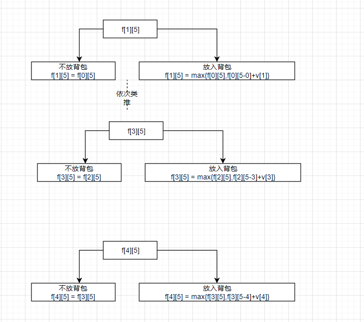

### 01背包问题
有N件物品和一个容量为V的背包，每个物品只能使用一次，
第i件物品的体积时Vi，价值为wi
求解将哪些物品装入背包，可使物品的总体积不超过背包的容量，且总价值最大，并输出最大值。

第一行两个整数，N，V，用空格隔开，分别表示物品数量和背包容积。

接下来有 N 行，每行两个整数 wi,vi，用空格隔开，分别表示第 i 件物品的体积和价值

### 题目思路
这是一道经典的算法设计，解题之前，我们不妨先看个实际场景，一个小偷准备去某个大户人家偷东西，小偷带了一个包，该包的最大容积为5体积，该大户人家中物品的体积和价值如下：
```txt
体积    价值
 1       2
 2       4
 3       4
 4       5
```
问该小偷应该怎么选择物品，才能获得最大的物品价值？

按照小偷的思路，小偷面对一个物品的时候只有两种选择，放进包中或者不放进包中，那他怎么抉择？一般会经过如下思路：
```txt
1、如果当前的物品体积过大不能放进包中，那么他将会选择另一个物品
2、如果当前的物品体积不大，那么他可以将此物品不放进包中时自己所得的价值和放入包中时，包中的剩余体积的最大价值作比较，谁大选谁
```

下面我们尝试着按照案例模拟以下思路，假设f[i][j]表示在最大体积为j的情况下，对于前i个物品的最大价值即为f[i][j],当i = 0时代表没有物品去选择，价值为0，假设现在小偷按照如上的思路正准备偷第3个物品，如图：
<br />

<br/>
在上面的图中可能有的同学会问，为什么放入背包的时候最大体积变小了，因为当决定放入背包中时，体积已经被该放入物品使用了，因此需要用剩余体积能装的最大价值加上当前的价值为f[i][j]的价值。

因此在这个思路中，我们不仅需要知道当体积为V时的最大价值，还要知道0~V时的最大价值。通过上面的举例不难看出每个体积的最大价值都用了二维数组进行标记。

看到这如果还不懂，我们可以这样想，小偷在选择放入物品或者不放入时，其实物品并没有真的放入，而是小偷在自己的脑子中记下了一个数字，该数字表示了前i个位置，在最大体积为v(0~V)的情况下的最大价值。更为直观我们可以看如下的二维数组为f[i][j]的在不同体积的时的最大值，第一行的数列表示最大体积,第一列为物品数字代表体积同时也代表了i
```txts
    0  1  2  3  4  5
1   0  0  0  0  0  0
2   0  2  2  2  2  2
3   0  2  4  6  6  6
4   0  2  4  6  6  8
5   0  2  4  6  6  8
```
知道了上述的思路，我们可以总结出如下公式：
已知：result = max{f[n][0~v]}
不选择第i个物品，则max = max{f[i-1][j]}
选择第i个物品，则max = max{f[i][j],f[i-1][j-v[i]]}

### 代码思路
1、首先需要初始化一个二维数组存放f[i][j]
2、用V[i]、W[i]表示第i个物品的体积和价值。

代码如下：
```go
func getMaxValue() {
	//对每个物品进行赋值体积和价值
	for i := 1; i <= N; i++ {
		fmt.Scanf("%d %d\n", &w[i], &v[i])
	}
	for i := 1; i <= N; i++ {
		for j := 0; j <= V; j++ {
			// 判断是否太重
			if j < w[i] {
				f[i][j] = f[i-1][j]
			} else {
				f[i][j] = f[i-1][j]
				f[i][j] = max(f[i][j], f[i-1][j-w[i]]+v[i])
			}

		}
	}
	for i := 0; i <= N; i++ {
		for j := 0; j <= V; j++ {
			fmt.Print(f[i][j], "  ")
		}
		fmt.Println()
	}
	fmt.Println(f[N][V])
}
```
### 优化代码
上述代码中出现了两次f[i][j] = f[i-1][j]，说明无论是否可以装下，都要进行该操作，因此if-else语句可以更换成如下代码：
```go
f[i][j] = f[i-1][j]
if j >= w[i] {
    f[i][j] = max(f[i][j], f[i-1][j-w[i]]+v[i])
}
```

### 使用滚动数组优化
举例:
```txt
体积    价值
 1       2
 2       4
 3       4
 4       5
```
放入第一个物体
空间为5， f(5) = 2
空间为4， f(4) = 2
空间为3， f(3) = 2
空间为2， f(2) = 2
空间为1， f(1) = 2

放入第二个物体
空间为5，不放入：f(5) = 2, 放入：max{f(5),f(3)+4}=6
空间为4，不放入：f(4) = 2, 放入：max{f(4),f(2)+4}=6
空间为3，不放入：f(3) = 2, 放入：max{f(3),f(1)+4}=6
空间为2，不放入：f(2) = 2, 放入：max{f(2),f(0)+4}=4
空间为1,结束

放入第三个物体
空间为5，不放入：f(5) = 6, 放入：max{f(5),f(2)+4}=8
空间为4，不放入：f(4) = 6, 放入：max{f(4),f(1)+4}=6
空间为3，不放入：f(3) = 6, 放入：max{f(3),f(0)+4}=4
空间为2，结束
.......

以此类推，我们发现不停的更换数组值，用这样的思路【滚动数组】的方式就可以只用一维数组进行标记我们的值即可。内循环结束的条件为最大体积空间大于等于待放入的物体体积

以下为摘抄01背包问题用滚动数组优化比较官方的解释：
观察转移方程 dp[i][j] = max{ dp[i-1][j - w[i]] + value[i], dp[i-1][j] }。 
发现 dp[i] 的状态仅仅和 dp[i-1]有关，所以仅仅只需要保存 i-1 时刻dp的状态。 
考虑用一个一位数组 dp， dp[j] 表示背包容量 j 时的最大价值。 
在考虑是否要放进物体 i 的之前，此时 dp[j] 数组保存的状态还是用前 i - 1 个物体放进容量为 j 时候的最大价值。所以可以直接用原来的dp[j] 来代替原来的 dp[i-1][j]。 
对于状态方程的一项 dp[i-1][j - w[i]] + value[i]，可以明确 j - w[i] < j。因为考虑物体 i 时需要更新的 dp[j] （即dp[i][j]）需要通过dp[i-1][j - w[i]]来计算。为了保证使用的dp[j - w[i]]是仅考虑完第 i - 1个物体时候的值，所以dp[j - w[i]]的值更新要发生在dp[j]之后。又因为 j - w[i] < j，所以 dp[j] 需要逆序更新。如果是顺序更新，那么容量为 j - w[i] 和容量为 j 两种情况下，很有可能会放进同一个物体两次只要该物体的容量比 j - w[i]还小，所以不符合这个背包问题的约束。

代码如下：
```go
func getMaxValue_two() {
	for i := 1; i <= N; i++ {
		for j := V; j >= w[i]; j-- {
			fmt.Println(j, "  ", j-w[i])
			f_two[j] = max(f_two[j], f_two[j-w[i]]+v[i])
		}
	}

	fmt.Println(f_two[V])
}
```


