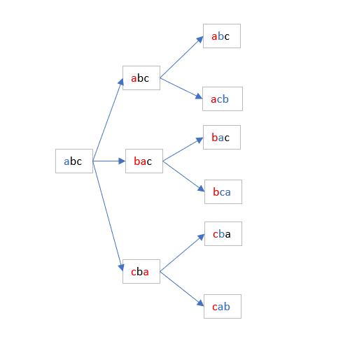

### 题目要求

输入一个字符串，打印出该字符串中字符的所有排列，例如，输入字符串 "abc",则
输出由字符 'a'、'b'、'c' 所能排列的所有字符串 ："abc" "acb" "bac" "bca" "cab" "cba"
###  递归实现
在这里需要强调一点的是，当打算使用递归的思想去实现你的代码逻辑的时候
一定不要去想代码怎么实现，首先应该想的是一个如何将一个大规模的问题转
换成小规模，而转换的过程可以采用同一种方法进行计算。

### 什么是递归
1、一个过程或函数在其定义或说明中有直接或间接调用自身的一种方法，它通常把一个大型复杂的问题层层转化为一个与原问题相似的规模较小的问题来求解（百度百科）
2、在数学与计算机科学中，是指在函数的定义中使用函数自身的方法。递归一词还较常用于描述以自相似方法重复事物的过程。例如，当两面镜子相互之间近似平行时，镜中嵌套的图像是以无限递归的形式出现的。也可以理解为自我复制的过程。（维基百科）

### 递归算法的特性
- 必须有可达到的终止条件，否则程序陷入死循环
- 子问题在规模上比原问题小
- 子问题可通过再次递归调用求解
- 子问题的解应能组合成整个问题的解

### 本题思路
举例 
1、a进行全排列，结果是a
2、ab进行全排列，结果为ab，ba;我们分别让a与a进行交换，a与b进行交换，
3、abc进行全排列，结果是abc,acb,bac,bca,cab,cba；我们画一张图进行表示 
<br />

<br />

**解释**
- 首先对于abc来说，我们我们可以对a进行交换位置得到一个全排列。
- 拿得到的第一个全排列abc进行举例，固定我们的a，采用同样的方法，对bc进行全排列得到bc，cb，拿出bc，对b进行固定，采用同样的方法进行全排列，最终结束到c，输出abc
- 下面的依次采用同样的方法，进行每一层的递归；

### 代码逻辑
1、每一次的全排列如何得到？
```
采用循环我们的字符串，分别将当前的字符与第一个字符进行交换
```
2、什么时候结束
```
当准备进行字符串全排列的时候，对我们的当前字符和带交换的字符进行一个位置比较，如果位置相同则结束，输出字符串；
```

### 代码实现
```go
func CalcALLPermutation(str *string, from int, to int) {
	strr := []rune(*str)
	if to <= 1 {
		return
	}
	if from == to {
		fmt.Println("最终结果：", string(strr))
	} else {
		for j := from; j <= to; j++ {
			strr[j], strr[from] = strr[from], strr[j]
			*str = string(strr)
			CalcALLPermutation(str, from+1, to)
		}
	}
}
```